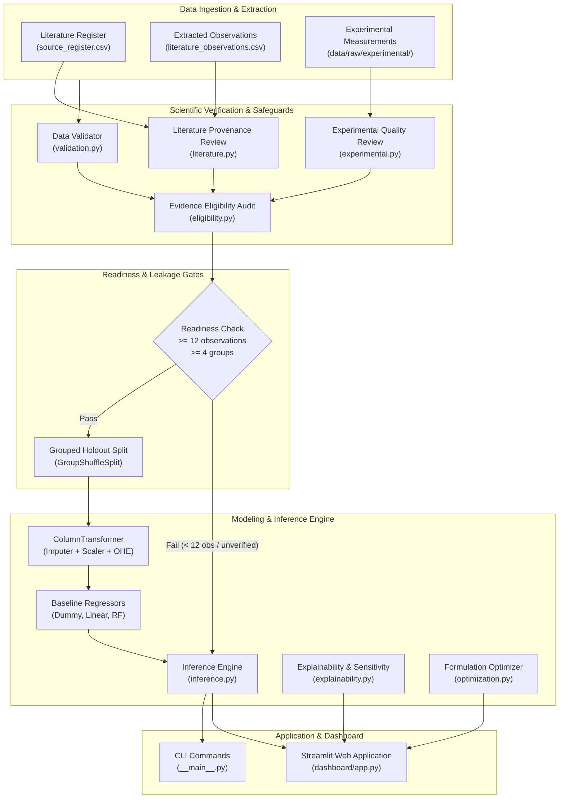
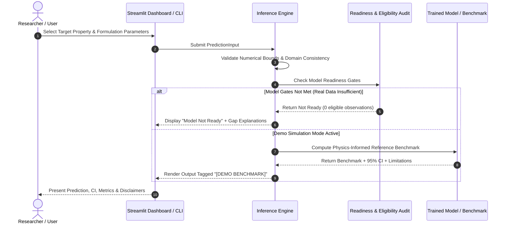

# EcoFiber AI — System Architecture & Data Pipeline

## 1. System Overview

EcoFiber AI is a trustworthy, scientifically grounded machine-learning platform designed for predicting, analyzing, and optimizing bio-composites reinforced with natural fibers extracted from invasive plant species (*Ipomoea carnea*).

The system enforces strict data provenance, separation of evidence categories, leakage-aware validation, and transparent readiness gates to prevent false claims and unscientific generalizations.

---

## 2. Core Modules

| Module | Responsibility | Key Classes / Functions |
|---|---|---|
| [`schema.py`](../src/ecofiber_ai/schema.py) | Canonical observation columns, supported property types, and canonical units (`MPa`, `kJ/m^2`, `%`). | `CANONICAL_COLUMNS`, `SUPPORTED_UNITS`, `canonical_unit()` |
| [`validation.py`](../src/ecofiber_ai/validation.py) | Non-filtering schema, type, duplicate, and numerical bounds validator. | `validate_dataframe()`, `load_csv()`, `ValidationReport` |
| [`compatibility.py`](../src/ecofiber_ai/compatibility.py) | Non-binding comparison report highlighting material and test standard differences. | `compare_compatibility()`, `CompatibilityReport` |
| [`audit.py`](../src/ecofiber_ai/audit.py) | File inventory, provenance completeness, and modeling readiness scanner. | `audit_datasets()`, `DatasetAudit` |
| [`literature.py`](../src/ecofiber_ai/literature.py) | Bibliographic register verification, extraction-type validation, and source acceptance tracker. | `review_literature()`, `validate_source_register()`, `LiteratureReview` |
| [`experimental.py`](../src/ecofiber_ai/experimental.py) | Specimen-level quality review, duplicate measurement detection, and batch group analysis. | `review_experimental_csv()`, `ExperimentalQualityReport` |
| [`eligibility.py`](../src/ecofiber_ai/eligibility.py) | Comprehensive evidence eligibility audit across sources, observations, and target properties. | `build_eligibility_audit()`, `EligibilityAuditReport` |
| [`readiness.py`](../src/ecofiber_ai/readiness.py) | Non-training snapshot aggregating dataset audit, literature review, and experimental readiness. | `build_readiness_report()`, `ReadinessReport` |
| [`modeling.py`](../src/ecofiber_ai/modeling.py) | Leakage-aware grouped evaluation (`GroupShuffleSplit`), preprocessing pipelines, and model evaluation. | `run_baseline()`, `evaluate_grouped_models()`, `build_preprocessing_pipeline()` |
| [`inference.py`](../src/ecofiber_ai/inference.py) | Domain bounds validation, readiness verification, and 95% confidence interval estimation. | `predict_property()`, `validate_prediction_input()`, `PredictionResult` |
| [`explainability.py`](../src/ecofiber_ai/explainability.py) | Feature importance ranking and 1D parameter sensitivity sweeps. | `compute_feature_importances()`, `sweep_parameter()` |
| [`optimization.py`](../src/ecofiber_ai/optimization.py) | Constrained multi-objective formulation optimization and Pareto-front generation. | `optimize_formulation()`, `OptimizationResult` |
| [`dashboard/app.py`](../dashboard/app.py) | Interactive Streamlit application for end-to-end hackathon demonstration. | 5 interactive tabs covering predictions, audits, explainability, optimization, and data studio. |

---

## 3. Data Flow & Provenance Architecture

---

## 4. Key Scientific Invariants

1. **No Silent Imputation:** Missing measurements are never fabricated or filled from secondary unverified sources.
2. **Evidence-Type Segregation:** `graph_estimate`, `inferred`, and `reported_value` (unspecified statistic) are preserved in literature records for provenance but blocked from entering model training.
3. **No Cross-Species Merging:** Water hyacinth (*Eichhornia crassipes*) and bamboo records are quarantined in separate staged extraction folders and never mixed with *Ipomoea carnea*.
4. **Grouped Leakage Prevention:** `GroupShuffleSplit` ensures coupons from the same batch or publication source remain strictly grouped in either train or test, preventing optimistic performance overestimation.
